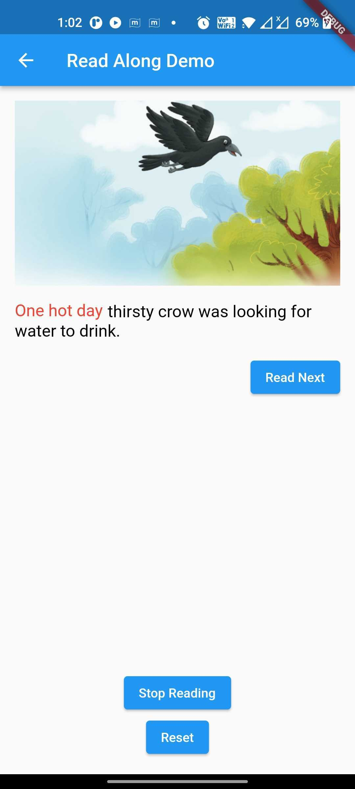

# flutter-read-along

## Overview
This feature will be used to enhance the reading ability of speakers. It will recognize the speech that has been spoken and based on that it will highlight the words if it is correctly spoken. It helps to improve child’s speaking when they learn to read.

Screenshot

